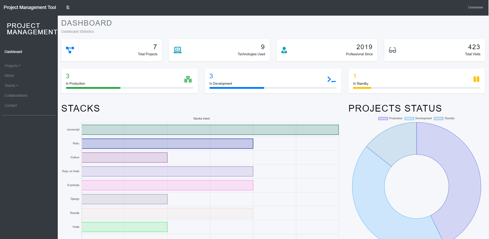
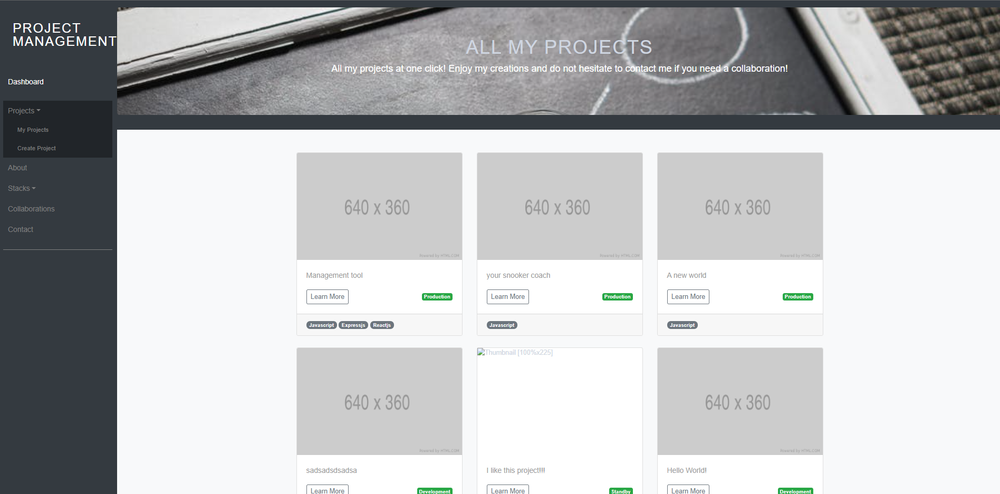
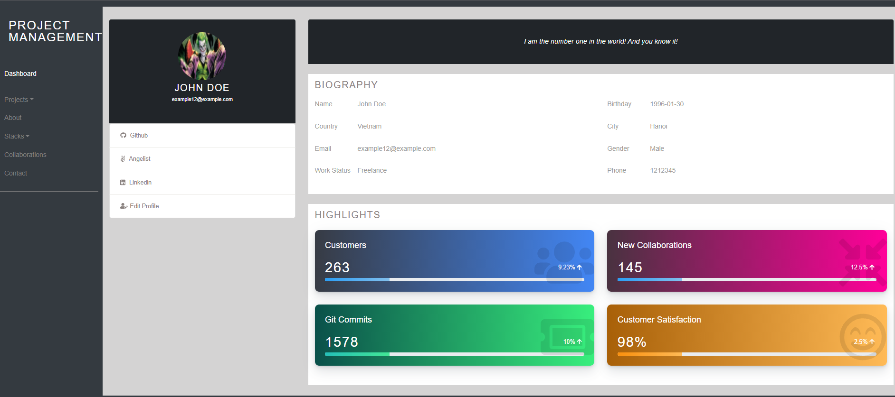
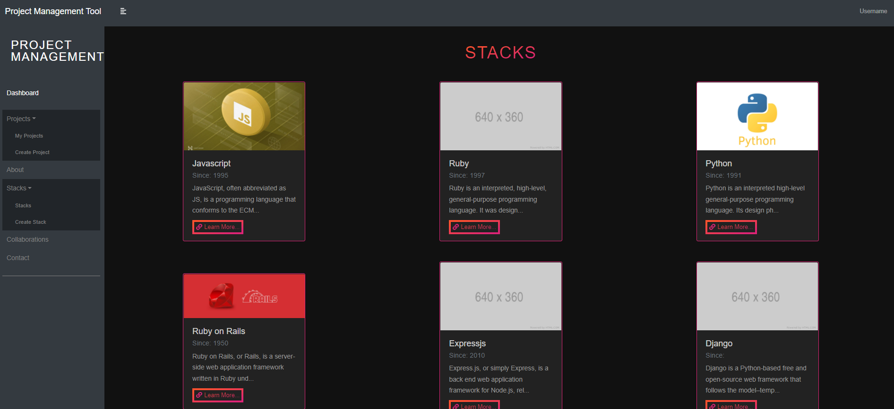

<!--
This README would normally document whatever steps are necessary to get the
application up and running.

Things you may want to c<!--
*** Thanks for checking out this README Template. If you have a suggestion that would
*** make this better, please fork the repo and create a pull request or simply open
*** an issue with the tag "enhancement".
*** Thanks again! Now go create something AMAZING! :D
-->

<!-- PROJECT SHIELDS -->
<!--
*** I'm using markdown "reference style" links for readability.
*** Reference links are enclosed in brackets [ ] instead of parentheses ( ).
*** See the bottom of this document for the declaration of the reference variables
*** for contributors-url, forks-url, etc. This is an optional, concise syntax you may use.
*** https://www.markdownguide.org/basic-syntax/#reference-style-links
-->
[![Contributors][contributors-shield]][contributors-url] 
[![Forks][forks-shield]][forks-url] 
[![Stargazers][stars-shield]][stars-url] 
[![Issues][issues-shield]][issues-url] 
 

# Project Management Tool (MERN Stack)

A modern, full-stack project management application built with MongoDB, Express.js, React 18, and Node.js.

## 🚀 Features

- Create and manage projects with details, status, and tech stacks
- Organize projects by technology stacks
- Track project progress with visual charts
- Upload project images
- User profile management
- Responsive design with modern UI
- RESTful API architecture

## 🛠 Tech Stack

### Frontend
- **React 18** - Modern UI library with hooks
- **Redux Toolkit** - State management
- **React Router v6** - Client-side routing
- **React Bootstrap** - UI components
- **Chart.js** - Data visualization
- **CSS Modules** - Scoped styling

### Backend
- **Node.js** - JavaScript runtime
- **Express.js** - Web framework
- **MongoDB** - NoSQL database
- **Mongoose** - MongoDB ODM
- **Multer** - File uploads
- **Helmet** - Security headers
- **Express Validator** - Input validation

## 📁 Project Structure

```
project-manager/
├── backend/                 # Backend API (Node.js/Express)
│   ├── server.js           # Server entry point
│   ├── app.js              # Express configuration
│   ├── config/             # Configuration files
│   ├── controllers/        # Business logic
│   ├── models/             # Mongoose schemas
│   ├── routes/             # API routes
│   ├── middleware/         # Custom middleware
│   ├── validators/         # Input validation
│   ├── utils/              # Utilities
│   ├── public/             # Static files
│   │   └── images/         # Uploaded images
│   ├── package.json        # Backend dependencies
│   └── README.md           # Backend documentation
├── frontend/               # Frontend app (React)
│   ├── public/             # Static files
│   ├── src/
│   │   ├── components/     # React components (.jsx)
│   │   ├── containers/     # Page components (.jsx)
│   │   ├── actions/        # Redux actions
│   │   ├── reducers/       # Redux reducers
│   │   ├── store/          # Redux store
│   │   └── style/          # CSS modules
│   ├── package.json        # Frontend dependencies
│   └── README.md           # Frontend documentation
├── assets/                 # Project screenshots
├── .env.example            # Environment variables template
├── package.json            # Root package.json (scripts)
├── README.md               # This file
├── ARCHITECTURE.md         # System architecture
├── CHANGES.md              # Changelog
└── BACKEND_MODERNIZATION.md # Backend migration guide
```

## 📋 Prerequisites

- Node.js (v16 or higher)
- MongoDB (local or Atlas)
- npm or yarn

## 🔧 Installation

1. **Clone the repository:**
```bash
git clone https://github.com/Pranav140/Project-manager.git
cd Project-manager
```

2. **Install all dependencies (backend + frontend):**
```bash
npm run install-all
```

Or install separately:

```bash
# Backend
cd backend
npm install

# Frontend
cd ../frontend
npm install
```

3. **Create environment file:**
```bash
cd backend
cp .env.example .env
```

4. **Configure environment variables in `backend/.env`:**
```env
MONGODB_URI=your_mongodb_connection_string
PORT=8000
NODE_ENV=development
CLIENT_URL=http://localhost:3000
```

## 🚀 Running the Application

### Development Mode (Recommended)

**Option 1: Run both servers concurrently**
```bash
npm run dev:all
# Backend runs on http://localhost:8000
# Frontend runs on http://localhost:3000
```

**Option 2: Run servers separately**

**Terminal 1 - Backend:**
```bash
npm run server
# or: cd backend && npm run dev
```

**Terminal 2 - Frontend:**
```bash
npm run client
# or: cd frontend && npm start
```

### Production Mode

1. **Build frontend:**
```bash
npm run build
# or: cd frontend && npm run build
```

2. **Start server:**
```bash
npm start
# or: cd backend && npm start
# Serves both API and React app on http://localhost:8000
```

## 📚 API Documentation

### Base URL
```
http://localhost:8000/api
```

### Endpoints

#### Projects
```
GET    /api/projects       - Get all projects
GET    /api/projects/:id   - Get single project
POST   /api/projects       - Create project (multipart/form-data)
PUT    /api/projects/:id   - Update project (multipart/form-data)
DELETE /api/projects/:id   - Delete project
```

#### Stacks
```
GET    /api/stacks         - Get all stacks
GET    /api/stacks/:id     - Get single stack
POST   /api/stacks         - Create stack
PUT    /api/stacks/:id     - Update stack
DELETE /api/stacks/:id     - Delete stack
```

#### Profile
```
GET    /api/profile        - Get profile
POST   /api/profile        - Create profile (multipart/form-data)
PUT    /api/profile/:id    - Update profile (multipart/form-data)
```

#### Health Check
```
GET    /health             - Server health status
```

### Response Format

**Success:**
```json
{
  "success": true,
  "data": { ... }
}
```

**Error:**
```json
{
  "success": false,
  "error": "Error message"
}
```

## 🏗 Architecture

### Backend (MVC Pattern)
- **Models** - Data structure and database interaction
- **Controllers** - Business logic and request handling
- **Routes** - API endpoints and routing
- **Middleware** - Request processing and error handling
- **Validators** - Input validation rules

### Frontend (Component-Based)
- **Components** - Reusable UI components
- **Containers** - Page-level components
- **Redux** - Global state management
- **React Router** - Client-side routing

See [ARCHITECTURE.md](./ARCHITECTURE.md) for detailed information.

## 🔐 Security Features

- Helmet for security headers
- CORS configuration
- Input validation and sanitization
- File upload restrictions
- Error message sanitization
- MongoDB injection prevention

## 🎨 UI Features

- Modern dark theme with gradients
- Glassmorphism effects
- Smooth animations and transitions
- Responsive design
- Custom loading states
- Interactive hover effects

## 📖 Documentation

- [README.md](./README.md) - Main documentation (this file)
- [backend/README.md](./backend/README.md) - Backend quick start
- [backend/README_BACKEND.md](./backend/README_BACKEND.md) - Detailed backend docs
- [frontend/README.md](./frontend/README.md) - Frontend documentation
- [ARCHITECTURE.md](./ARCHITECTURE.md) - System architecture overview
- [CHANGES.md](./CHANGES.md) - Complete changelog
- [BACKEND_MODERNIZATION.md](./BACKEND_MODERNIZATION.md) - Backend migration guide

## 🧪 Testing

```bash
# Frontend tests
cd frontend
npm test

# Backend tests (to be implemented)
npm test
```

## 📦 Building for Production

```bash
# Build frontend
cd frontend
npm run build

# The build folder will be served by Express in production
```

## 🤝 Contributing

1. Fork the repository
2. Create your feature branch (`git checkout -b feature/AmazingFeature`)
3. Commit your changes (`git commit -m 'Add some AmazingFeature'`)
4. Push to the branch (`git push origin feature/AmazingFeature`)
5. Open a Pull Request

## 📝 License

This project is licensed under the MIT License - see the [LICENSE](LICENSE) file for details.

## 🙏 Acknowledgments

- React team for React 18
- Express.js community
- MongoDB team
- All open-source contributors

## 📧 Contact

For questions or support, please open an issue on GitHub.

---

**Built with ❤️ using the MERN stack**

>  A MERN project to manage all your personal projects, might be used as portfolio as well. Built with MERN stack and Redux.

Additional description about the project and its features.

Dashboard:






## Built With

- MONGODB
- EXPRESS JS
- REACT
- NODE JS
- REDUX
- REACT-BOOTSTRAP
- EXPRESS-VALIDATOR
- MULTER
- ESLINT
- GITHUB ACTIONS
- VSCODE

## Getting Started
### Usage
To have this app on your pc, you need to:
* [download](https://github.com/javitocor/Project-Management-Tool-MERN/archive/main.zip) or clone this repo:
  - Clone with SSH:
  ```
    git@github.com:javitocor/Project-Management-Tool-MERN.git
  ```
  - Clone with HTTPS
  ```
    https://github.com/javitocor/Project-Management-Tool-MERN.git
  ```

* In the project directory, you can run:

Install dependencies in your home folder with:

``` bash
   npm install
```

Go to the './frontend' folder and install the frontend dependencies:
```
  npm install
```

And then:
```
  npm run build
```
Back to the home folder, run the server:

``` bash
   npm run devstart
```
Access the page by typing in your web browser

``` bash
   http://127.0.0.1:8000/
```

You can also run the app but running the server in one port and react in another, like so:
on the project root, run:
```
npm run devstart
```
on the frontend folder, run:
```
npm start
```
You can access the app by typing http://localhost:3000 in the browser.

## Information about the project
### Endpoints
```
  All CRUD operations to manage Profile, Projects and Stacks.
```
## Author

👤 Javier Oriol Correas Sanchez Cuesta 
- Github: [@javitocor](https://github.com/javitocor) 
- Twitter: [@JavierCorreas4](https://twitter.com/JavierCorreas4) 
- Linkedin: [Javier Oriol Correas Sanchez Cuesta](https://www.linkedin.com/in/javier-correas-sanchez-cuesta-15289482/) 

## 🤝 Contributing

Contributions, issues and feature requests are welcome!

Feel free to check the [issues page](https://github.com/javitocor/Project-Management-Tool-MERN/issues).

## Show your support

Give a ⭐️ if you like this project!

## Acknowledgments 🚀

- [Express Docs](https://expressjs.com/)
- [React Docs](https://reactjs.org/docs/getting-started.html)
- [Redux Docs](https://redux.js.org/)
- [React Bootstrap Docs](https://react-bootstrap.github.io/)
- [Multer Docs](https://github.com/expressjs/multer)
- [Express Validator Docs](https://express-validator.github.io/)
- [Mongoose Docs](https://mongoosejs.com/)

## 📝 License

This project is [MIT](lic.url) licensed.

<!-- MARKDOWN LINKS & IMAGES -->
<!-- https://www.markdownguide.org/basic-syntax/#reference-style-links -->
[contributors-shield]: https://img.shields.io/github/contributors/javitocor/Project-Management-Tool-MERN.svg?style=flat-square
[contributors-url]: https://github.com/javitocor/Project-Management-Tool-MERN/graphs/contributors
[forks-shield]: https://img.shields.io/github/forks/javitocor/Project-Management-Tool-MERN.svg?style=flat-square
[forks-url]: https://github.com/javitocor/Project-Management-Tool-MERN/network/members
[stars-shield]: https://img.shields.io/github/stars/javitocor/Project-Management-Tool-MERN.svg?style=flat-square
[stars-url]: https://github.com/javitocor/Project-Management-Tool-MERN/stargazers
[issues-shield]: https://img.shields.io/github/issues/javitocor/Project-Management-Tool-MERN.svg?style=flat-square
[issues-url]: https://github.com/javitocor/Project-Management-Tool-MERN/issuesover:
